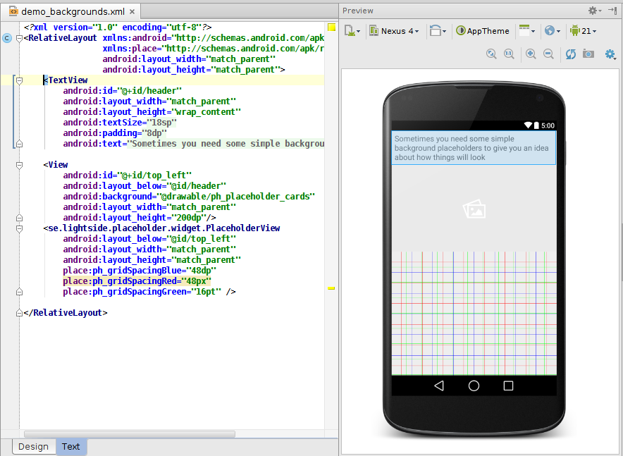
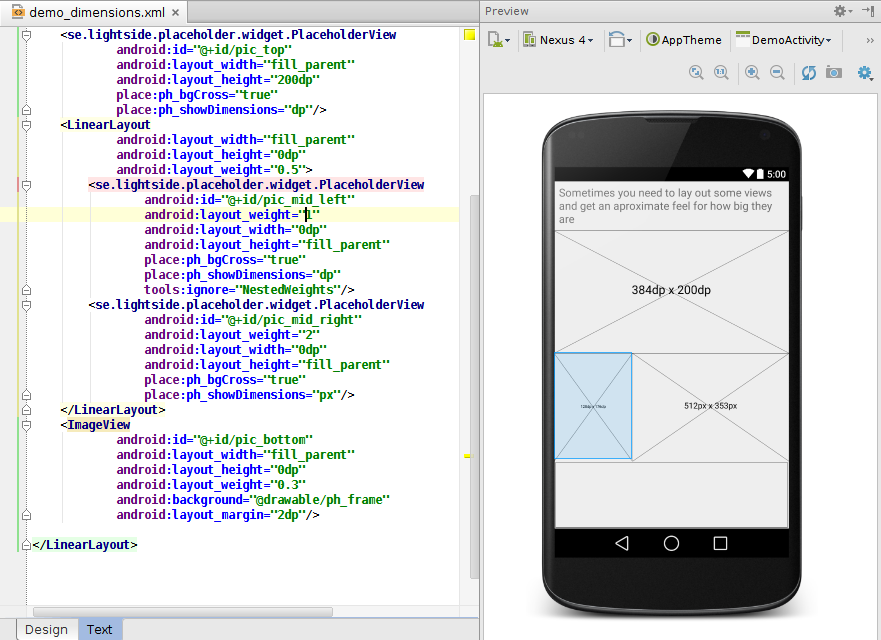
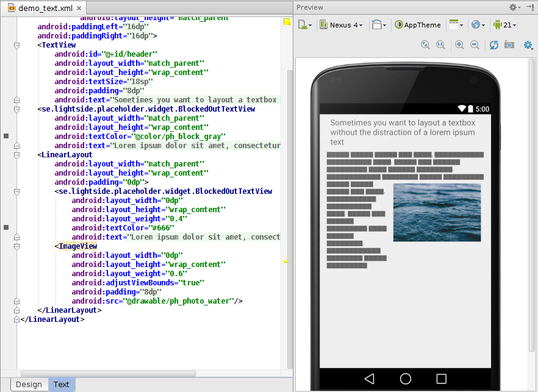
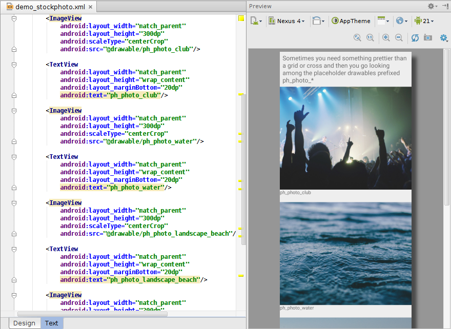

Overview
========

This android library provides a selection of UI placeholders for use while developing/mocking up a UI

Introduction
============

Have you ever been developing an android app and wished you had some sort of placeholder for
a bit of layout where there's going to be an image you haven't gotten around to fixing yet or
a big bit of text you haven't really gotten around to writing yet. You want to put something there
in the layout so you can see what it'll look like but you don't have it yet.

Well, I have. Repeatedly. So I figured I'd just throw a few helpful placeholders into this library.
It's not meant to be deployed with your app or anything that fancy. But if you just include it while
getting started you'll have access to a bunch of useful placeholders and then once you've gotten the
actual assets you want to use you can just drop this dependency.

Usage
=====

You can find the latest dev-version here 

[  ](https://bintray.com/liminal/android-placeholder/android-placeholder/_latestVersion)

Just add the library as a dependency in your android project and you're good to go.
```groovy
repositories {
    flatDir {
        dirs 'libs'
    }
}

dependencies {
    [...]
    compile 'se.lightside.placeholder:placeholder:0.2.0@aar'
}

```


(I'll try to get around to getting the .aar up on a proper repository but until then the above should work)

 Once it's in your dependencies you'll have access to a bunch of stock placeholder drawables in
 R.drawable.ph_* and a special PlaceholderView that provides some nice placeholder functionality
 (grids, printing the dimensions of the view, stuff like that).

 Take a look at the sample app if you want an idea of how it works.

 The main idea is that it should all just work and best of all it should all just work in the
 layout editor in Android Studio as well. After all, that was sort of the reason for it all.

Screenshots
===========






License
=======

     Copyright 2014 Karl Åström

     Licensed under the Apache License, Version 2.0 (the "License");
     you may not use this file except in compliance with the License.
     You may obtain a copy of the License at

        http://www.apache.org/licenses/LICENSE-2.0

     Unless required by applicable law or agreed to in writing, software
     distributed under the License is distributed on an "AS IS" BASIS,
     WITHOUT WARRANTIES OR CONDITIONS OF ANY KIND, either express or implied.
     See the License for the specific language governing permissions and
     limitations under the License.
